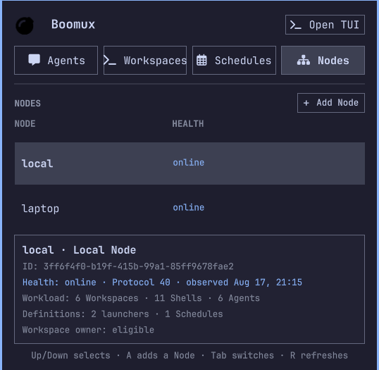

# Boomux for Omarchy

Monitor interactive Boomux Agents, manage coordinator-owned global Workspaces
across federated Nodes, and operate recurring Agent Schedules without leaving the
Omarchy bar.


## Features

- Keeps active Agents in a dedicated status tab
- Excludes schedule-owned Agents handled by Boomux scheduling
- Shows live `working`, `idle`, and `blocked` Agent states
- Highlights finished work and blocked attention in the bar
- Keeps finished markers visible until you open the corresponding Agent
- Groups Shells, Agents, launchers, and Schedules by global Workspace task
- Projects resources from multiple Node placements into one Workspace item list
- Opens complete workspaces or individual managed items
- Removes locally owned workspace items after confirming their specific impact
- Creates empty Workspaces from configured project-name suggestions or a custom name
- Opens an in-panel directory picker for Shell and Agent directories
- Prefills editable shell and Agent names from Boomux suggestions
- Starts new OpenCode or Pi command shells and lets their lifecycle integration
  register the Agent
- Acknowledges local durable attention when you open its Agent
- Lists Schedules across workspaces with scheduler status and their latest run
- Runs Schedules immediately and pauses or resumes future timed dispatch
- Launches the full Boomux TUI in a new native terminal
- Supports mouse and keyboard navigation and follows the active Omarchy theme
- Polls local Boomux state once per second for responsive updates
- Keeps Node ownership as secondary metadata instead of a Node filter or Node-first label
- Keeps cached stale resources visible but disables owner-dependent actions
- Keeps equal-name unlinked Node-local Workspaces as distinct external Workspaces
- Shows scheduler health independently per Node and disables owner-dependent
  actions while its state is stale or unavailable
- Lists every Node in a dedicated health table with protocol,
  freshness, eligibility, and exact identity details
- Opens interactive **Add Node** setup only in a local native terminal




## Requirements

- Omarchy with the Quattro shell plugin system
- [Boomux](https://github.com/gardnmi/boomux) `0.19.0` or newer available on
  `PATH`
- A configured native terminal supported by `xdg-terminal-exec`
- `curl` for optional passive update detection

Full global Workspace support requires Boomux protocol 38. Protocol 33 through
37 retain the qualified owner-local fallback described below.

Workspace management works with Boomux alone. Agent states and Agent creation
require the corresponding coding-agent executable and Boomux lifecycle
integration. For OpenCode or Pi, run:

```bash
boomux integration setup opencode
# or
boomux integration setup pi
```

The plugin does not automatically start a stopped Boomux daemon. Launch Boomux
or open a managed workspace before using the panel.

When the `boomux` executable is unavailable on `PATH`, the panel shows a
dedicated installation message, the repository URL, and an **Open Install Page**
button. It does not install Boomux automatically.

Global Workspace grouping activates only when the local CLI advertises the
protocol 38 global Workspace and multi-placement capabilities and the running
local daemon can negotiate them. Protocol 33 through 37 retain qualified
owner-local Workspace rows; older Boomux daemons retain the local-only panel.

Follow the setup command's restart and verification guidance. See the
[Boomux installation instructions](https://github.com/gardnmi/boomux#install)
if `boomux` is not installed yet.

## Install

Review the source before installing. Omarchy plugins run as unsandboxed code
inside the long-running shell process.

```bash
omarchy plugin add https://github.com/gardnmi/omarchy-boomux.git --enable
```

The widget defaults to the right bar section. If you installed it without
`--enable`, enable it later with:

```bash
omarchy plugin enable io.github.gardnmi.boomux --section right
```

## Use

| Input | Action |
| --- | --- |
| Left click | Open or close the panel |
| Right click | Refresh immediately |
| Tab or `1` / `2` / `3` / `4` | Switch between Agents, Workspaces, Schedules, and Nodes |
| `A` | From Nodes, open interactive Add Node in a native terminal |
| Up / Down | Select an Agent, workspace, Schedule, or Node |
| Enter | Open a selected Agent or select a workspace or Schedule |
| `D` | Dismiss the selected Agent notification |
| `N` | Create a workspace |
| `R` | Refresh immediately |
| Escape | Close the panel |

The **Open TUI** button launches the Boomux dashboard in a new native terminal
window. The Nodes tab keeps **Add Node** at section scope and opens Boomux's
guided Node setup in a local native terminal, where Boomux alone handles SSH
authentication, remote install details, and confirmation. The terminal remains
open after setup so its success or failure is visible. The Node table keeps the
full health state visible and marks stale projections as cached. Selecting a
Node shows its exact ID, observed protocol and time, resource counts, and
Workspace-owner eligibility. It does not display SSH routes or turn
Nodes into a Workspace filter. Selecting a Workspace shows its items and scoped
**Open**, **Shell**, **Agent**, and **Remove Workspace** actions below the
Workspace dropdown. Clicking a shell, command, or Agent opens its managed terminal;
clicking a launcher invokes that detached command. Opening a managed terminal
takes over its writable controller so the new window receives the authoritative
terminal size and input stream. Expanded Workspace details remain inside the
panel and scroll when their items exceed the available detail surface.

**New Workspace** creates empty coordinator metadata and offers the same project
names Boomux discovers from configured `[projects].roots`. Search and select a
project to use its canonical name, or choose **Custom** to enter another name.
The displayed project path is a discovery hint only: creating the Workspace does
not assign a Node, persist that path, create a Shell, or start a process. Choose
the exact Node and directory later when adding the first Shell or Agent; that
resource establishes the placement. The panel never invents a placement when
several Nodes are eligible. **Browse** is available in Shell and Agent forms for
local paths; remote paths come only from Boomux's owner-routed services.

Configure the suggestions in Boomux, for example:

```toml
[projects]
roots = ["~/Projects", "~/Work"]
max_depth = 3
```


Each locally owned workspace item has a **Remove** button. Remote item removal is
not offered by the panel. Removing a shell, command, or Agent
item closes its exact backing shell, terminates it if running, and deletes its
shell definition and retained terminal state. Durable Agent history may remain
available for acknowledgement. Removing a launcher deletes only that launcher
definition; applications it already launched keep running. Both operations ask
for confirmation before changing the workspace. Removing a Workspace also asks
for confirmation and removes its managed processes, launchers, schedules and
persisted prompts, retained state, Agent and attention records, and metadata. A
coordinated close can remain visibly `closing` when an owner is unavailable or a
placement is still `close_pending`; Boomux retains the unresolved membership
until that owner confirms removal or the close is retried outside the panel.

Opening a complete global Workspace is one Boomux fan-out request. Available
placements start immediately and unavailable owners do not block them. Boomux invokes its launchers,
takes over active terminal controllers, and restarts exited shells. Workspace
restore is non-transactional, so some items can open even if another item fails.
Opening an individual exited shell or command restarts its stored process.

Agent creation records and opens a command-backed shell whose exact command is
`opencode` or `pi`. The installed lifecycle integration creates the authoritative
Agent record after the coding-agent host starts; the plugin does not fabricate
Agent lifecycle state.

Shell and Agent forms request an unreserved generated name from Boomux for the
exact selected owner placement when one already exists. The field remains editable, and typing is never
overwritten by a delayed suggestion. Another client can claim the suggested
name before creation; Boomux remains authoritative and reports that collision.
Both forms expose a **Select Node** dropdown and default it to the eligible local
Node; selecting another Node updates placement-specific name and path defaults.

The bomb icon changes with Agent state. Blocked work uses the urgent color;
finished work uses the accent color. The spark turns yellow while either alert
is active. Use the Agent row's **Dismiss** button or press `D` to clear a local
finished marker and acknowledge durable attention without opening the terminal.
For a locally owned Agent, durable attention is acknowledged with the exact Agent
ID and observation revision. Local blocked attention is also acknowledged when
that Agent reports it is working again. Remote attention remains visible and
must be handled through Boomux outside the panel; it is not cleared by opening
the remote Agent.

The **Schedules** surface activates only when the installed CLI advertises the
required JSON commands and the running daemon supports protocol 25 or newer.
The Schedule dropdown identifies each definition by name and Workspace.
The detail surface shows prompt-free configuration and the latest retained run.
Clicking that run asks Boomux to open its exact active shell run or resume its
exact linked Agent Session; it never restarts the private Schedule runner shell
or substitutes a later run. **Run Now** can start an Agent and its permitted
tool, filesystem, and network activity even while a Schedule is paused.
**Pause** prevents future timed dispatch but does not cancel active work;
**Resume** plans future occurrences without catching up paused time. Execution
failures do not change the bomb's Agent-attention spark. Federated Schedules use
each owner Node's scheduler health. Live remote controls and exact execution
reads include that Node's exact ID and are disabled for cached stale,
reconnecting, unreachable, authentication, identity, or unsupported states.

## Update

```bash
omarchy plugin update io.github.gardnmi.boomux
```

Omarchy rescans plugins after an update; a shell restart is not normally needed.
When `curl` is available, the plugin performs two bounded, read-only HTTPS checks
against GitHub: the latest stable Boomux release and the published plugin manifest on
`main`. Newer semantic versions add an upward-arrow badge, unless an Agent alert
count takes precedence, and separate links to the Boomux release page and plugin
repository. Failures are silent. These links never run the update command or
download or install anything automatically.

## Remove

```bash
omarchy plugin remove io.github.gardnmi.boomux
```

Removal deletes only the plugin checkout and its bar entry. It does not remove
Boomux, stop or delete Boomux workspaces, or remove Boomux Agent integrations
and data.

## Data And Privacy

- The plugin checks only the local daemon status once per second without starting
  it. On protocol 38 it consumes local `boomux node snapshot --json`, containing
  coordinator Workspaces plus rich local and bounded prompt-free cached remote
  state. It never polls a remote host itself. Protocol 37 snapshots fall back to
  owner-local grouping; older daemons use the previous local Agent, shell, and
  workspace commands. Prompt-free exact latest-run reads occur only in the Schedules tab.
- The passive `boomux capabilities --json` check gates Schedule support. The
  plugin never requests or displays persisted Schedule prompts. When New
  Workspace opens, the advertised passive `boomux project list --json` command
  scans configured roots without contacting or starting the daemon.
- QML makes no SSH requests and does not read or store credentials. Its only
  direct network access is the bounded startup update check against the fixed
  Boomux GitHub release API and plugin `main` manifest URLs. Every management
  command targets the local Boomux CLI; Boomux owns verified routing,
  authentication, installation confirmation, and its bounded cache.
- The plugin does not persist Node projections, prompts, credentials, attachment
  environments, remote terminal content, remote paths, or routes. The Nodes tab
  displays only prompt-free snapshot health, counts, observed protocol, and
  exact Node identity.
- The directory browser reads names of local readable subdirectories only while
  it is open; it does not read file contents or send paths elsewhere.
- Boomux may deliver one locally deduplicated, bounded reconnect attention digest
  after a verified remote cursor resumes. The plugin presents Boomux's durable
  projected attention after refresh; it does not derive or deliver notifications
  from health changes, execution outcomes, quiet output, or cache reseeds.
- It does not modify Boomux or Omarchy configuration directly.
- After a locally owned Agent terminal opens successfully, its notification is explicitly
  dismissed, or a blocked Agent reports `working` again, the plugin can run the
  local, revision-conditional `boomux attention acknowledge` command. Attention
  for an Agent whose shell was removed can also be dismissed directly from its
  row.
- Opening the dashboard or a managed shell launches a native terminal process.
- Workspace actions can create or open workspaces, create shells on eligible
  Nodes, remove local shells, and invoke remote or local launchers while removing
  only local launchers. Shell removal can terminate a running
  process and deletes retained terminal state. Launcher removal does not stop
  applications already launched. Workspace restore can run commands, open
  native terminals, disconnect existing writable terminal controllers, and
  restart exited shells.
- Schedule actions can start Agent processes and pause or resume future timed
  dispatch. Opening the latest run can attach its exact active run or launch its
  harness to resume the exact linked session. Schedule actions do not edit
  prompts, cancel executions, or remove Schedules.
- Supported remote opens, creation, launcher invocation, and Schedule actions
  include the resource's structural Node identity. Per-item removal and attention
  acknowledgement remain local-only. Stale rows remain visible but cannot
  launch, mutate, acknowledge, inspect private state, or start owner-side
  processes; offline writes are never queued.
- Protocol 37 and older CLIs do not expose Node context on attention acknowledgment,
  workspace/shell creation, or destructive workspace/shell/launcher mutations.
  Those controls remain disabled for remote owners rather than dropping Node
  identity or accidentally applying an operation locally.

## Troubleshooting

### Boomux is unavailable

Confirm Boomux is installed and healthy:

```bash
command -v boomux
boomux doctor
boomux list --json
```

### Agents appear as terminals

Confirm a lifecycle integration is installed and reporting:

```bash
boomux integration status
boomux agent list --json
```

Restart the coding-agent host after installing or updating its integration.

### The panel looks stale

Right-click the bomb or press `R`. If plugin code was just updated but did not
reload, request a plugin rescan:

```bash
omarchy-shell shell rescanPlugins
```

### A remote Node is stale or unavailable

Agent metadata and Schedule details report relevant owner Node health.
`reconnecting` and `stale` retain the last bounded projection. `unreachable`, `authentication required`,
`identity changed`, `identity conflict`, and `unsupported` require owner or route
attention. Controls remain disabled until Boomux reports a current,
identity-verified `online` observation. Inspect through the local CLI:

```bash
boomux node list --json
boomux node snapshot --json
boomux doctor
```

Use **Add Node** for a new registration so authentication and bootstrap
confirmation stay in the native terminal rather than the panel.

## Development

Deploy the complete working tree while Quickshell is stopped, then restart it:

```bash
mise run restart
```

This makes the installed plugin checkout dirty. Restore or remove local test
changes before using `omarchy plugin update` again.

Validate the repository with:

```bash
omarchy plugin validate .
qmllint -I /usr/share/omarchy/shell Panel.qml
xmllint --noout assets/bomb.svg assets/bomb-spark.svg
bash -n deploy-local.sh
bun test tests/workspace-model.test.js
mise tasks
git diff --check
boomux --version
boomux capabilities --json
boomux daemon status --json
```

Protocol 38 live validation additionally needs two privacy-safe Nodes to verify
multi-placement grouping, equal-name external collisions, mismatched paths,
health and reconnect behavior, explicit creation placement, exact action routing,
global fan-out, remote PTY attachment, Schedule controls, and reconnect attention
presentation. Do not fabricate Node screenshots or use
private paths, titles, prompts, terminal output, or targets.

## License

The plugin code is licensed under the [MIT License](LICENSE). The bomb icon is
adapted from [Font Awesome Free](https://fontawesome.com/icons/bomb) under
[CC BY 4.0](https://creativecommons.org/licenses/by/4.0/). See
[THIRD_PARTY_NOTICES.md](THIRD_PARTY_NOTICES.md).
