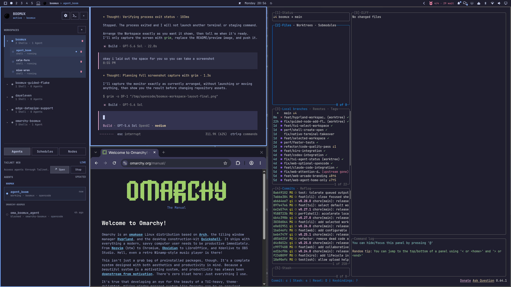

# Boomux for Omarchy

A persistent Omarchy side pane for navigating Boomux Workspaces, opening managed
terminals, monitoring Agents, and checking Schedules and Nodes.

> [!IMPORTANT]
> This plugin does not work without [Boomux](https://github.com/gardnmi/boomux).
> Install Boomux first and ensure `boomux` is available on `PATH`.

<p align="center">
  
</p>

## Highlights

- Keeps an expandable multi-Workspace tree visible above Agent, Schedule, and
  Node views.
- Reserves the left or right screen edge so Hyprland tiles applications beside
  the pane instead of covering them.
- Presents coordinated Workspaces immediately through Boomux's Hyprland desktop
  integration.
- Shows the active Workspace, focused managed terminal, Agent attention, Node
  health, and scheduler state.
- Opens exact Shells and Agents while keeping the pane visible.
- Uses compact, confirmed removal actions for local Workspaces, Shells, and
  launchers.

## Requirements

- Omarchy with the Quattro shell plugin system.
- [Boomux](https://github.com/gardnmi/boomux) `0.27.0` or newer on `PATH`.
- A native terminal supported by `xdg-terminal-exec`.

Global multi-Node Workspaces require Boomux protocol 38. Agent status requires a
supported lifecycle integration:

```console
boomux integration list
boomux integration setup <name>
```

## Install

Omarchy plugins run as unsandboxed code inside the shell process. Review the
source, then install and enable it:

```console
omarchy plugin add https://github.com/gardnmi/omarchy-boomux.git --enable
```

The widget defaults to the right bar section and opens a pane from the left edge.

## Use

| Input | Action |
| --- | --- |
| Bar icon | Open or close the pane |
| Right-click bar icon | Refresh |
| Workspace row | Select and present that Workspace |
| Workspace chevron | Expand Shells, commands, and launchers |
| Shell, command, or Agent row | Open the exact managed terminal |
| Trash icon | Confirm removal of the local resource |
| `Tab` or `1` / `2` / `3` | Switch Agents, Schedules, and Nodes |
| `A` in Nodes | Open guided Node setup |
| `D` in Agents | Dismiss the selected notification |
| `N` | Create a Workspace |
| `R` | Refresh |
| `Escape` | Close the pane |

For direct keyboard access:

```lua
hl.unbind("SUPER + B")
o.bind("SUPER + B", "Toggle Boomux panel",
  "omarchy-shell io.github.gardnmi.boomux toggle")
```

Selecting a coordinated Workspace presents its existing Hyprland layer and
stores it as Boomux's default Workspace. It does not restore every Shell or run
launchers. Older compatible Boomux versions fall back to `workspace open --show`.

The terminal button opens the full Boomux TUI. The pane remains visible while
applications receive focus and while other Omarchy plugins open.

## Settings

Use the gear button to:

- Move the pane to the left or right edge.
- Adjust its width in 20-pixel steps.
- Open `boomux config edit` in a native terminal.

Omarchy stores pane settings in `~/.config/omarchy/shell.json`:

```json
{
  "id": "io.github.gardnmi.boomux",
  "side": "right",
  "paneWidth": 400
}
```

## Safety

- The plugin talks only to the local Boomux CLI; Boomux owns daemon lifecycle,
  remote routing, authentication, and persistence.
- Remote cached resources stay visible but become non-actionable when stale or
  unavailable.
- Destructive local actions require confirmation and use exact resource IDs.
- Removing a Shell can terminate its process and delete retained terminal state.
  Removing a launcher does not stop applications it already started.
- The plugin never reads Schedule prompts, credentials, attachment environments,
  or remote terminal content.
- Its only direct network activity is a bounded update check against fixed GitHub
  release and manifest URLs.

## Maintenance

Update:

```console
omarchy plugin update io.github.gardnmi.boomux
```

Remove:

```console
omarchy plugin remove io.github.gardnmi.boomux
```

Removing the plugin does not remove Boomux, stop managed processes, or delete
Boomux data.

If the pane appears stale, right-click the bar icon or press `R`. For CLI issues:

```console
boomux doctor
boomux capabilities --json
boomux daemon status --json
```

## Development

Deploy the complete local plugin and restart Quickshell:

```console
mise run restart
```

Validate changes:

```console
omarchy plugin validate .
qmllint -I /usr/share/omarchy/shell Panel.qml SidePane.qml
xmllint --noout assets/bomb.svg assets/bomb-spark.svg
bash -n deploy-local.sh
bun test tests/workspace-model.test.js
git diff --check
```

## License

Code is licensed under the [MIT License](LICENSE). The bomb icon is adapted from
[Font Awesome Free](https://fontawesome.com/icons/bomb) under
[CC BY 4.0](https://creativecommons.org/licenses/by/4.0/). See
[THIRD_PARTY_NOTICES.md](THIRD_PARTY_NOTICES.md).
